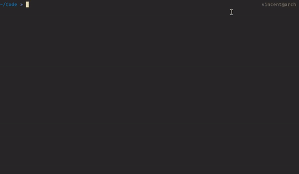

# kickstart

A CLI tool to easily get a new project up and running by using pre-made templates.
This is a slightly more powerful version of an equivalent tool in Python, [cookiecutter](https://github.com/cookiecutter/cookiecutter). It is an alternative to NodeJS projects such as [Yeoman](https://yeoman.io/) or [Slush](https://github.com/slushjs/slush).

[](https://crates.io/crates/kickstart)



## Installation

`kickstart` is available only through crates.io:

```bash
$ cargo install kickstart
```

Or as a pre-built binary [on the Releases page](https://github.com/Keats/kickstart/releases).

Run `kickstart --help` for a full listing of the available commands and their flags/options.

## Features

- Cross-platform: Windows, Mac and Linux supported
- Single binary: no need to install a virtualenv or anything else
- Simple to use
- Directory names and filenames can be templated: `{{ repo_name }}/{{author}}.md` is a valid path
- All templating done through [Tera][] - a template engine inspired by Jinja2
- Choose your own adventure: it supports conditional questions based on previous answers
- It can load templates from a local directory or from a Git repository
- It has conditional cleanup to not let irrelevant files in the output directory after generation
- Templates can be made for any kind of projects/languages
- Case conversion filters, e.g. `camelCase` to `CamelCase`

The main drawback compared to cookiecutter is the lack of hook scripts support, which can be mitigated a bit by the conditional cleanup.

Lastly, since Windows does not allow `|` in file paths, you may use a [tera built-in filter][builtin]
by using the `$$` separator instead.

Note that, in file templates, you should keep using `|` for filtering, as the `$$` syntax is only for files and directories. 
Keep in mind the characters `()` are not allowed on Windows so do not use filter parameters if you want to be cross-platform.

[tera]: https://keats.github.io/tera/docs/
[builtin]: https://keats.github.io/tera/docs/#built-in-filters

## Try it out

```bash
# From the root of this repo
$ kickstart examples/super-basic
$ kickstart examples/complex -o Hello
# Anywhere
$ kickstart https://github.com/Keats/kickstart -s examples/super-basic
$ kickstart https://github.com/Keats/kickstart-sample -o sample
```

## Creating your own template
Creating a template is fairly simple: create files and then just add a `template.toml` in the root folder. Here is a description of all the fields available in it:

```toml
# Required, name of the template
name = "Django"

# Optional, longer form description
description = "A fully-featured Django template"

# Required, the version of the kickstart schema, currently only `1` is used
kickstart_version = 1

# Optional, the URL of the template
url = "https://google.com"

# Optional, a list of authors for this template
authors = [

]

# Optional, a list of keywords for this template
keywords = [

]

# Optional, those files will NOT be copied over when generating the template
# Use it to remove template-specific like its CI or its README/docs
ignore = [
    "README.md",
    "CONTRIBUTING.md",
    ".travis.yml",
    "docs",
]

# If this is set, kickstart will use this directory as a base for the template instead of
# the root directory. This is useful when your template has its own documentation/CI/etc and you don't want
# to ignore it.
directory = "some-directory"

# Optional, a list of patterns. All files matching one of the patterns will
# be copied over without going through Tera.
# Use it for files that contain syntax similar to Tera for example
copy_without_render = [
    "*.html",
]

# Optional, a list of cleanup actions to do.
# All paths listed will be deleted if the `name` has the value `value` after
# the questions have been answered and the project generated.
cleanup = [
    { name = "spa", value = true, paths = ["{{ project_name }}/templates/"]},
    { name = "auth_method", value = "none", paths = ["{{ project_name }}/docs/auth.md"]},
]

# A list of variables, the schema is explained in detail below
[[variables]]
name = "project_name"
default = "my-project"
prompt = "What is the name of this project?"
validation = "^([a-zA-Z][a-zA-Z0-9_-]+)$"

[[variables]]
name = "database"
default = "postgres"
prompt = "Which database do you want to use?"
choices = ["postgres", "mysql", "sqlite"]

[[variables]]
name = "pg_version"
default = "10.4"
prompt = "Which version of Postgres?"
choices =  [
    "10.4",
    "10.3",
    "10.2",
    "10.1",
    "9.6",
    "9.5",
    "9.4",
    "9.3",
]
only_if = { name = "database", value = "postgres" }

[[variables]]
name = "auth_method"
default = "jwt"
prompt = "How are users going to be authenticated?"
choices = ["jwt", "sessions", "none"]

[[variables]]
name = "sentry"
default = true
prompt = "Do you want to add Sentry integration?"

[[variables]]
name = "spa"
default = false
prompt = "Is the frontend a SPA?"

[[variables]]
name = "js_framework"
default = "React"
prompt = "Which JS framework do you want to setup?"
choices =  [
    "React",
    "Angular",
    "Vue",
    "None",
]
only_if = { name = "spa", value = true }

[[variables]]
name = "typescript"
default = true
prompt = "Do you want to use TypeScript?"
only_if = { name = "spa", value = true }

```

A variable has the following required fields:

- `name`: the name of the variable in Tera context
- `default`: the default value for that question, `kickstart` uses that to deduce the type of that value (only string, bool and integer are currently supported). 
You can use previous variables in the default, eg `"{{ project_name | lower }}"` will replace `project_name` with the value of the variable.
- `prompt`: the text to display to the user

And three more optional fields:

- `choices`: a list of potential values, `kickstart` will make the user pick one
- `only_if`: this question will only be asked if the variable `name` has the value `value`
- `validation`: a Regex pattern to check when getting a string value

## List of templates

- [Rust CLI application](https://github.com/Keats/rust-cli-template)

## Case Conversion Filters
Case conversion filters are provided (_via [heck](https://github.com/withoutboats/heck)_):
- `upper_camel_case`: UpperCamelCase
- `camel_case`: lowerCamelCase
- `snake_case`: snake_case
- `kebab_case`: kebab-case
- `shouty_snake_case`: SHOUTY_SNAKE_CASE
- `title_case`: Title Case
- `shouty_kebab_case`: SHOUTY-KEBAB-CASE

You can use these like any other filter, e.g. `{{variable_name | camel_case}}`.

## Changelog

### 0.5.0 (unreleased)

- The `sub-dir` parameter has been renamed to `directory` in the CLI
- Templates with a `directory` field will now no longer include that directory name in the output

### 0.4.0 (2023-08-02)

- Add case conversion filter
- Update dependencies

### 0.3.0 (2021-07-10)

- Update dependencies

### 0.2.1 (2020-02-07)

- Allow using `$$` for filters in filenames/directories

### 0.2.0 (2020-01-09)

- Update all dependencies
- Add the `directory` field to change the template directory away from the current one
- VCS files are not automatically ignored anymore

### 0.1.8 (2018-09-30)

- Allow loading templates from a subdirectory

### 0.1.7 (2018-08-09)

- Work with Git aliases
- The crate now works as a library as well as a binary

### 0.1.6 (2018-08-02)

- Add a `--no-input` flag to the main command to generate a template from defaults
- Validate that a template only uses allowed TOML types (String, integer and boolean) in `validate` command
- Better question UI

### 0.1.5 (2018-07-31)

- Fix git clone command

### 0.1.4 (2018-07-31)

- Fix missing error display impl
- Fix TOML error not showing up
- Fix multi-layered questions being asked when they shouldn't

### 0.1.3 (2018-07-31)

- Add pattern to match in the question when there is on

### 0.1.2 (2018-07-31)

- Add optional `validation` field to validate a string against a regex
- Add colours and boldness to CLI
- Use `git` command rather than git2 crate to avoid some build issues
- Add `cleanup` field to template definition for post-generation cleanup
- Add `validate` command to diagnose errors in a `template.toml` file
